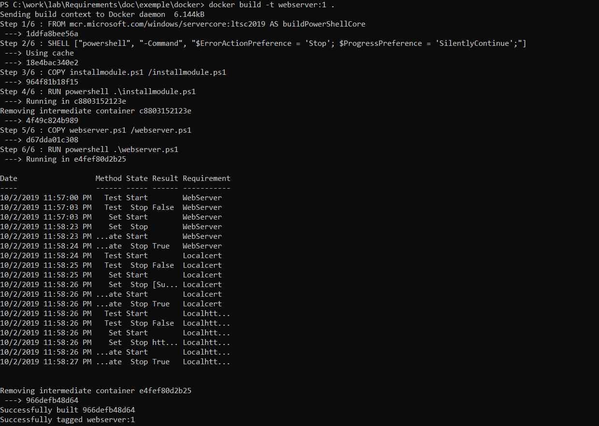

# Examples

This section include examples on how you can use Requirements

##  Web Server

This example show how to set up IIS and SSL binding with a selfsigned certificat on Windows 2016/2019 server using PowerShell 5.1.

To perform the operation you can simply use .\webserverinstall.ps1 as administrator

You will need to install the Requirements module first.

```powershell
install-module -name Requirements -Scope CurrentUser
```

```powershell
#Requires -RunAsAdministrator

import-module -name Requirements

$Requirement = @(

    @{
        Name     = "WebServer"
        Describe = "Web Server feature is present in the system"
        Test     = { (Get-WindowsFeature -Name web-server -ErrorAction SilentlyContinue).installed }
        Set      = { Add-WindowsFeature Web-Server | Out-Null; Start-Sleep 1 }
    },
    @{
        Name     = "Localcert"
        Describe = "Create a selfsigned certificat for intranet.mydomain.com"
        Test     = {
                    "CN=intranet.mydomain.com" -in (Get-ChildItem "Cert:\LocalMachine\My").Subject
                   }
        Set      = { New-SelfSignedCertificate -DnsName intranet.mydomain.com -CertStoreLocation cert:\LocalMachine\My }
        DependsOn = "WebServer"
    },
    @{
        Name     = "LocalhttpsBinding"
        Describe = "Create a selfsigned certificat for intranet.mydomain.com"
        Test     = {
                        $CertObject = (Get-ChildItem "Cert:\LocalMachine\My" -ErrorAction SilentlyContinue) | where-object subject -eq CN=intranet.mydomain.com
                        $CertStringHash = $CertObject.GetCertHashString()

                        Import-Module IISAdministration
                        $WebSites = Get-IISServerManager

                         ($WebSites.sites["Default web site"].Bindings.GetEnumerator() | where-object protocol -eq https) -ne $null -And  ($WebSites.sites["Default web site"].Bindings | where-object protocol -eq https).RawAttributes.certificateHash -eq $CertStringHash
                   }
        Set     =  { 
                        Import-Module IISAdministration
                        $CertObject = (Get-ChildItem "Cert:\LocalMachine\My" -ErrorAction SilentlyContinue) | where-object subject -eq CN=intranet.mydomain.com
                        $Certhash = $CertObject.GetCertHash()

                        $WebSites = Get-IISServerManager
                        if ($WebSites.Sites["Default Web Site"].Bindings.Count -eq 2 ) {
                            $WebSites.Sites["Default Web Site"].Bindings.RemoveAt(1)
                        }
                        $WebSites.Sites["Default Web Site"].Bindings.Add("*:443:", $Certhash, "My", "0")

                        $WebSites.CommitChanges()
                    }
        DependsOn = "WebServer","Localcert"
    }
)


$Requirement | Invoke-Requirement | format-table
```

## Web Server in Docker

the Requirements module work also in a Windows container.

To Build it.

```
docker build -t webserver:1 .
```

It produce:

 
